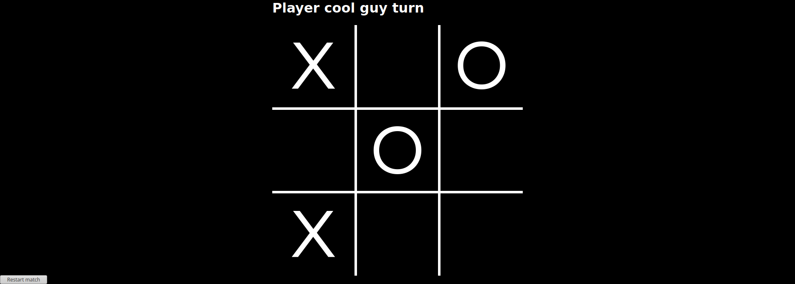

# JS Tic-Tac-Toe

> This is a tic-tac-toe page project, we used javascript, HTML, and CSS to create a playable game inside the browser making use of functions and DOM

## Built With

- Javascript
- HTML
- CSS

## Authors

👤 **Ricardo Vera**

- Github: [@ricardo123321](https://github.com/ricardo123321)
- Twitter: [@ricardo123321](https://twitter.com/ricardo123321)
- Linkedin: [linkedin](https://linkedin.com/in/ricardo123321)

👤 **Johann Rodriguez**

- Github: [@JohannRodriguez](https://github.com/JohannRodriguez)
- Twitter: [@BSapce](https://https://twitter.com/BSapce)
- Linkedin: [Johann Rodríguez](https://www.linkedin.com/in/johann-alonso-rodr%C3%ADguez-v%C3%A1zquez-25b07719a/)

## 🤝 Contributing

Contributions, issues, and feature requests are welcome!

Feel free to check the [issues page](issues/).

## Show your support

Give a ⭐️ if you like this project!

## Acknowledgments

- Hat tip to anyone whose code was used
- Inspiration
- etc

## 📝 License

This project is [MIT](lic.url) licensed.
